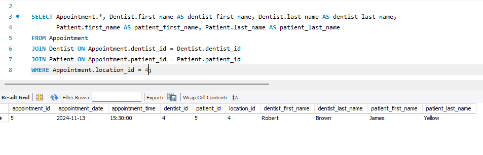

# ER Diagram for Denntist System

# SQL Queries

## List of all Dentists sorted by last name:

## List of all Appointments for a given Dentist with Patient information:

## List of all Appointments scheduled at a specific Surgery Location:

## List of Appointments booked for a Patient on a specific Date:

